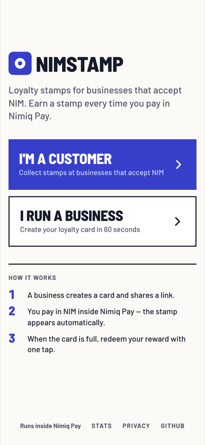
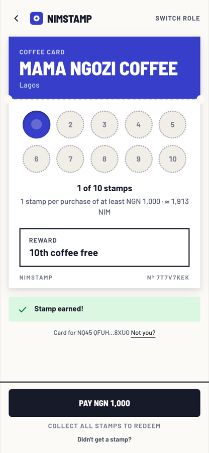
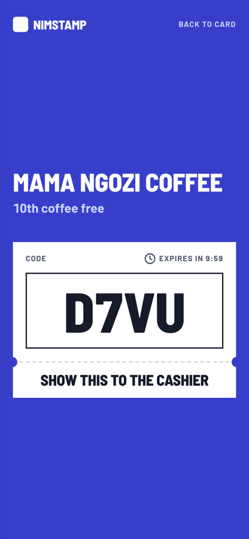
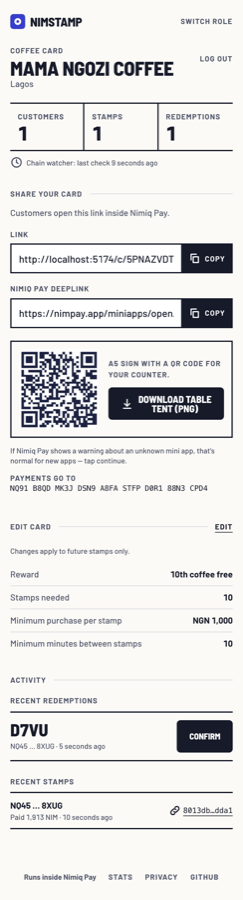
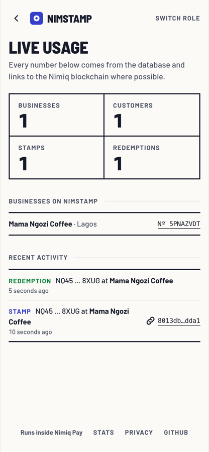
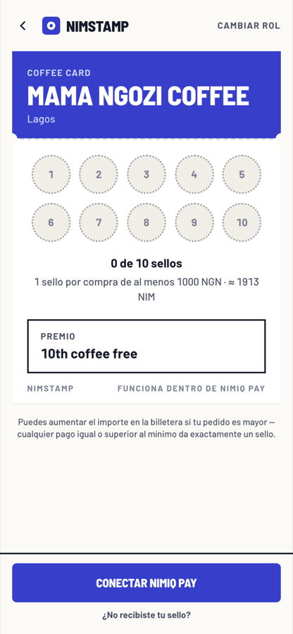
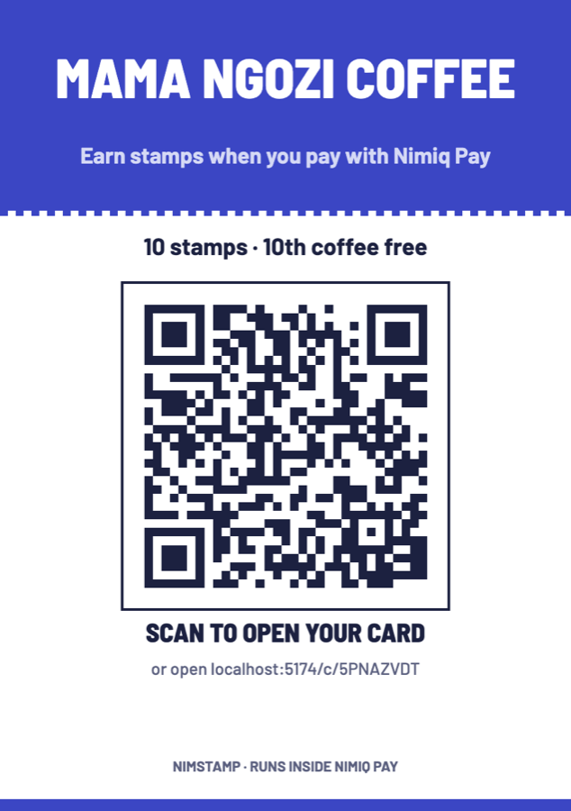

# NimStamp

**A self-serve loyalty stamp card that lives inside Nimiq Pay.** Any merchant creates a card in 60 seconds; customers earn a stamp automatically every time they pay the merchant in NIM; rewards are redeemed with a wallet signature and a 4-character code the cashier can trust.

Nimiq's built-in rewards work at curated partner locations; NimStamp lets any merchant anywhere set up loyalty in 60 seconds.

Built for the **Nimiq Mini Apps Competition, Cycle II**. MIT licensed. Runs inside Nimiq Pay.

| Role picker | Card (stamp earned) | Redemption code | Merchant dashboard |
|---|---|---|---|
|  |  |  |  |

| Public stats | Spanish UI | Printable table tent (A5) |
|---|---|---|
|  |  |  |

## Who it's for
- **Customers:** anyone with Nimiq Pay and a few NIM. Open a merchant's link, tap **Pay**, confirm in the wallet, and the stamp appears within seconds. No QR scanning, no cashier action.
- **Merchants:** small businesses. Sign in with the wallet that receives payments, fill one form, share a link or print the table tent.

## How it uses Nimiq Pay
| Feature | API |
|---|---|
| Identity | `init()` + `listAccounts()` |
| Payments with a tagged memo | `sendBasicTransactionWithData({ recipient, value, data: 'NS1:<card>:<nonce>' })` — amounts in Luna |
| Merchant login and reward redemption | `sign(message)` — Ed25519 signature verified server-side; address derived from the public key |
| Anti-abuse | `requestDeviceIdentifier({ reason })` — max 3 cards per device per business |
| Localisation | `window.nimiqPay.language` → EN / ES / DE / FR |
| Sharing | `https://nimpay.app/miniapps/open/<host>/c/<cardId>` deeplinks and QR table tents |

**The server is the only authority.** The client never says "I paid"; it sends a memo-tagged transaction and the Worker's chain watcher confirms it on the Nimiq blockchain through JSON-RPC. Rewards are merchant-funded vouchers, so NimStamp never holds or pays out NIM.

## Architecture
```
┌──────────────────────────────┐        ┌──────────────────────────────┐
│  Nimiq Pay (native app)      │        │  Laptop browser (merchant)   │
│  ┌────────────────────────┐  │        │  same bundle, no provider    │
│  │  NimStamp web app      │  │        │  (QR handoff login)          │
│  │  (WebView, Vite+React) │  │        └──────────────┬───────────────┘
│  └───────────┬────────────┘  │                       │
│   injected provider          │                       │
└──────────────┼───────────────┘                       │
               │ HTTPS JSON                            │
               ▼                                       ▼
        ┌──────────────────────────────────────────────────────┐
        │  API — Cloudflare Worker (Hono, TypeScript)          │
        │  • REST endpoints          • signature verification  │
        │  • chain watcher (cron)    • price fetch (cron)      │
        └───────┬──────────────────────────┬───────────────────┘
                ▼                          ▼
        ┌───────────────┐        ┌────────────────────┐
        │ Cloudflare D1 │        │ Nimiq JSON-RPC node │
        └───────────────┘        └────────────────────┘
```

Payment → stamp flow: the app asks the API for a **payment intent** (nonce, memo, NIM amount computed from the fiat minimum at the current price), opens the wallet's native confirmation with that memo, and polls. The Worker's cron (every minute, plus an immediate check after the app's notify call) reads the merchant address history, matches memo + sender + amount + expiry, and inserts the stamp (transaction hash is UNIQUE, so it is idempotent). If a stamp is missing, the customer pastes the transaction hash and the server verifies it on chain.

## Repository layout
```
packages/web   Vite + React 18 + TypeScript + Tailwind — the mini app
  src/wallet/  WalletProvider adapter: nimiqPayProvider.ts (only file importing @nimiq/mini-app-sdk) + mockProvider.ts
  src/pages/   RolePicker, Card, Claim, Redeem, MerchantSetup, MerchantLogin, MerchantDashboard, Stats, Privacy, NotFound
  src/i18n/    en / es / de / fr dictionaries
packages/api   Cloudflare Worker (Hono) + D1
  src/routes/  auth, merchants, cards (customer cards + intents), payments (notify, claim), redemptions, stats, demo
  src/chain/   rpc.ts (JSON-RPC client), matching.ts (pure §7.3 rules), watcher.ts (cron + notify)
  src/crypto/  verify.ts — Ed25519 + Nimiq signed-message scheme, address derivation
  src/db/      schema.sql, queries.ts
  test/        vitest: address/checksum, memo parsing, signatures (3 schemes), matching rules
docs/          SPEC.md, VERIFIED.md (Day-0 gate), DEPLOY.md, DEVICE_CHECKLIST.md, PRIVACY.md, STATS.md
```

## Setup
```bash
pnpm install
cp packages/api/.dev.vars.example packages/api/.dev.vars
cd packages/api && pnpm db:migrate:local && pnpm dev     # API on :8787, DEMO_MODE=1
cd packages/web && cp .env.example .env && pnpm dev       # web on :5173 with the mock wallet
pnpm test && pnpm typecheck
```
See [docs/DEPLOY.md](docs/DEPLOY.md) for production (Cloudflare Pages + Workers + D1) and [docs/DEVICE_CHECKLIST.md](docs/DEVICE_CHECKLIST.md) for the on-phone acceptance tests.

## Design
The interface is a recharge scratch card: one committed ultramarine panel on warm paper, punched stamp panels, a silver strip that scratches off to reveal the cashier code, and slab controls in condensed caps for bright counters and mid-range phones. Tokens and rules are documented in [DESIGN.md](DESIGN.md); product truth in [PRODUCT.md](PRODUCT.md). Fonts: Barlow / Barlow Semi Condensed (OFL), self-hosted.

## Security & privacy
- No secrets in the repo: `SESSION_SECRET` and optional RPC / price keys are Wrangler secrets; `.env.example` and `.dev.vars.example` are committed with placeholders.
- Every route validates input with zod; SQL is parameterised; sessions are stored hashed; logs never contain signatures, tokens or device IDs.
- Anti-abuse: server-side fiat minimum, per-device card cap, hashed-IP cap when the device ID is declined, one stamp per 10 minutes per customer (merchant-adjustable), single-use nonces, UNIQUE transaction hashes, expiring intents / challenges / codes.
- Privacy notice: [docs/PRIVACY.md](docs/PRIVACY.md), served at `/privacy` in four languages. Device-ID request carries the reason "Prevent duplicate loyalty cards on this phone".

## Live app
- Web: https://nimstamp.vercel.app (Vercel)
- Open inside Nimiq Pay: https://nimpay.app/miniapps/open/nimstamp.vercel.app
- API: https://nimstamp-api.nimstamp.workers.dev ([health](https://nimstamp-api.nimstamp.workers.dev/health)) — Cloudflare Worker + D1
- Stats: https://nimstamp.vercel.app/stats

## Team
- Lead: Godswill Idolor ([@big14way](https://github.com/big14way))

## Credits
[@nimiq/mini-app-sdk](https://www.npmjs.com/package/@nimiq/mini-app-sdk) (MIT) · [Hono](https://hono.dev) (MIT) · [zod](https://zod.dev) (MIT) · [@noble/curves](https://github.com/paulmillr/noble-curves) and [@noble/hashes](https://github.com/paulmillr/noble-hashes) (MIT) · [React](https://react.dev) (MIT) · [react-router](https://reactrouter.com) (MIT) · [i18next](https://www.i18next.com) / [react-i18next](https://react.i18next.com) (MIT) · [qrcode](https://github.com/soldair/node-qrcode) (MIT) · [Tailwind CSS](https://tailwindcss.com) (MIT) · [Barlow](https://github.com/jpt/barlow) by Jeremy Tribby (OFL) via [Fontsource](https://fontsource.org) · design pass with [Impeccable](https://github.com/pbakaus/impeccable) · [Vite](https://vite.dev) (MIT) · Cloudflare Workers, Pages and D1 · public Nimiq RPC by [nimiq.watch](https://nimiq.watch) · prices by [CoinGecko](https://www.coingecko.com) and [open.er-api.com](https://open.er-api.com).

The Nimiq name is used descriptively ("runs inside Nimiq Pay"); no Nimiq logo or wordmark is used.
